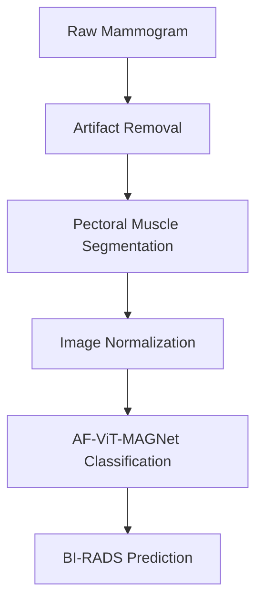

# Mammography Preprocessing Pipeline


A modular mammography preprocessing framework for artifact suppression, pectoral muscle segmentation, and image standardization designed to improve the reliability of downstream deep learning models for breast cancer analysis.

## 🔬 Research Context
This repository contains a modular preprocessing framework developed during a one-year research internship in Medical Image Analysis & Deep Learning focused on mammography analysis.

## 📚 Related Research Repositories

This repository represents the preprocessing stage of a larger mammography AI research pipeline.

- 🔹 **Mammography-Preprocessing-Pipeline** *(Current Repository)*
- 🔹 [Mammography-Pectoral-Segmentation-U-Net](https://github.com/affaanshk/Mammography-Pectoral-Segmentation-U-Net)
- 🔹 [AF-ViT-MAGNet-Breast-Cancer-Classification](https://github.com/affaanshk/AF-ViT-MAGNet-Breast-Cancer-Classification)

  ## 🧬 Mammography AI Research Suite

```text
├── 📦 Mammography-Preprocessing-Pipeline
│      Data preparation & normalization
│
├── 📦 Mammography-Pectoral-Segmentation-U-Net
│      Anatomical segmentation
│
└── 📦 AF-ViT-MAGNet-Breast-Cancer-Classification
       BI-RADS prediction & benchmarking
```


- 
## 🏗️ Overall Research Pipeline

This repository implements the preprocessing stage of the complete mammography AI workflow. TThe preprocessing pipeline integrates artifact removal, pectoral muscle segmentation, and image normalization to generate standardized mammograms for downstream breast cancer classification using AF-ViT-MAGNet.

## 🚀 Key Engineering Features
* **Deep Learning-Based Pectoral Muscle Segmentation:** Utilizing a U-Net architecture integrated with a ResNet18 encoder to identify and isolate the pectoral muscle wall.
* **Traditional Computer Vision Blending:** Implementation of mathematical distance transforms, Gaussian blurring, and morphological opening/closing operations to feather tissue edges smoothly into background space.
* **Reproducible Normalization Engine:** Multi-stage min-max contrast stretching, background heuristic calculation, and single-channel intensity scaling.

## 📂 Repository Layout
* `pipeline.py`: Main integration module structuring the unified execution sequence.
* `artifact_removal.py`: Implements pixel boundary cleanup and distance mapping suppression.
* `pectoral_suppression.py`: Handles deep-learning inference configurations and post-prediction mask processing.
* `mask_blending.py`: Isolates spatial feathering algorithms and matrix weight vectors.
* `normalization.py`: Manages resolution resizing, intensity mapping, and grayscale transformations.
* `utils.py`: Modular visualization subroutines, comparison matrix utilities, and panel configurations.

## 🛠️ Usage
```python
from pipeline import MammographyPreprocessingPipeline

# Initialize pipeline with model weights path
pipeline = MammographyPreprocessingPipeline(weights_path="path/to/weights.pth")

# Process single mammogram file
cleaned_tissue = pipeline.preprocess_image("sample_mammogram.png")
```

## 🛠️ Technologies

### Programming Language
- Python

### Deep Learning
- PyTorch
- Torchvision
- U-Net
- ResNet18

### Computer Vision & Image Processing
- OpenCV
- Pillow (PIL)
- NumPy
- SciPy
- Matplotlib

### Data Processing
- Pandas

### Medical Imaging
- Mammography Preprocessing
- Medical Image Analysis
- Pectoral Muscle Segmentation

### Dataset & Annotation
- Mini-DDSM
- LabelMe
- Manual Polygon Annotation

### Image Processing Techniques
- Morphological Operations
- Distance Transform
- Gaussian Blur
- Image Normalization
- Mask Feathering

### Development Tools
- Kaggle Notebooks
- Git
- GitHub
- Jupyter Notebook

## 🎯 Primary Objectives

- Remove acquisition artifacts
- Suppress pectoral muscle regions
- Standardize mammogram intensity
- Produce reproducible preprocessing pipelines
- Prepare mammograms for downstream deep learning models

## 📚 Citation

The associated research manuscript is currently under review.

Citation details will be added upon publication.

## 📄 License

This project is released under the MIT License.
